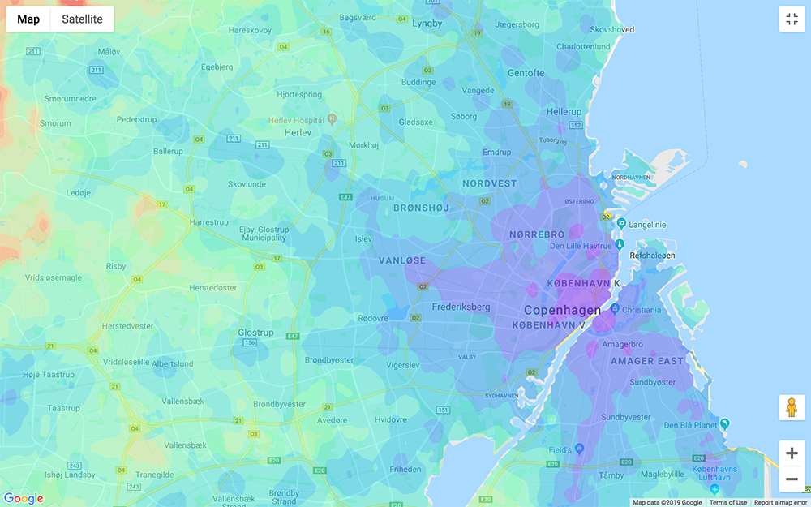

# google-maps-isochrone-overlay

Visualize travel times to a given location as an isochrone overlay on an interactive map using the Google Maps API. Supports bicycling, driving, transit, and walking.

### Installation
```
$ git clone https://github.com/andibarg/google-maps-isochrone-overlay.git
$ cd google-maps-isochrone-overlay
```

### Requirements

- Python 3
- Python packages: geopandas, googlemaps, shapely, re, scipy.
- Google Maps API key: https://developers.google.com/maps/documentation/geocoding/get-api-key
- Coastline data, e.g., from EEA https://www.eea.europa.eu/data-and-maps/data/eea-coastline-for-analysis-2

### Usage

Specify the destination coordinates and the arrival time in '1_get_data.py'. Set the corners and the resolution of the rectangular grid for which you want to extract the travel times. Specify the path of the txt-file containing the API key. The data will be written into 'data\traveldata.csv'.

Then, convert the data into an isochrone map by running '2_get_overlay.py'. Each filled contour corresponds to 10 min of traveling. The number of points in the mesh grid 'Nmesh' defines the degree of interpolation.

Finally, the script '3_get_html.py' creates an html file that shows the isochrone map as an image overlay in Google Maps.

### Example

The following figure shows an isochrone overlay to my current work place via public transportation in Copenhagen, Denmark. The arrival time is 2019/10/21 at 9am. The example uses coastline polygons for Zealand, Denmark extracted from the EEA dataset mentioned above.



### Similar work

- iso4app (http://www.iso4app.net/) 
- traveltimeplatform (https://www.traveltimeplatform.com/), 
- https://github.com/dugwood/isochrone-isodistance-with-google-maps
